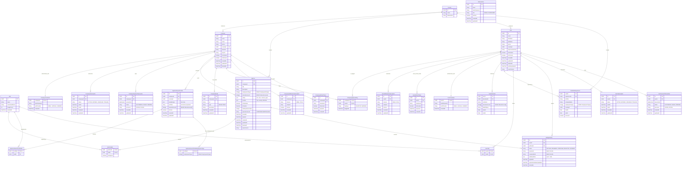

```mermaid
erDiagram
    %% =======================================================
    %% 🟢 CORE REFERENCE TABLES
    %% =======================================================

    Country {
        UUID id PK
        string name
        string abbreviation
    }

    Skill {
        UUID id PK
        string name
        string normalizedName
        int usageCount
        DateTime createdAt
    }

    %% =======================================================
    %% 🔵 COMPANY DOMAIN
    %% =======================================================

    Company {
        UUID id PK
        string email
        string name
        string phone
        UUID countryId FK
        string aboutUs
        string logoUrl
        boolean isActivated
        boolean isPremium
        DateTime createdAt
        DateTime updatedAt
        DateTime deletedAt
    }

    CompanyCredential {
        UUID companyId PK,FK
        string hashPassword
        string authProvider "EMAIL, GOOGLE, LINKEDIN"
        DateTime createdAt
    }

    CompanySubscription {
        UUID id PK
        UUID companyId FK
        string status "ACTIVE, EXPIRED, CANCELED, TRIALING"
        DateTime startAt
        DateTime endAt
        DateTime createdAt
        DateTime updatedAt
    }

    CompanyPaymentTransaction {
        UUID id PK
        UUID companyId FK
        BigDecimal amountUsd
        string status "SUCCEEDED, FAILED, PENDING"
        string processor "STRIPE, PAYPAL"
        DateTime createdAt
        DateTime updatedAt
    }

    JobPost {
        UUID id PK
        UUID companyId FK
        string title
        string description
        string[] employmentTypes "ENUM: EmploymentType[]"
        string[] educationLevels "ENUM: EducationLevel[]"
        json salary "min, max, currency, type"
        json location "city, country, isRemote"
        boolean isPublished
        boolean isFresher
        Integer minExperienceYears
        string experienceLevel "JUNIOR,MID,SENIOR,LEAD"
        DateTime postedAt
        DateTime expiryAt
        DateTime createdAt
        DateTime updatedAt
        DateTime deletedAt
        string searchVector
    }

    JobPostSkill {
        UUID jobPostId PK,FK
        UUID skillId PK,FK
        boolean isRequired
    }

    ApplicantSearchProfile {
        UUID id PK
        UUID companyId FK
        UUID countryId FK
        json salaryRange "min, max"
        string jobTitles "semicolon-separated"
        string[] educationLevels "ENUM: EducationLevel[]"
        boolean isActive
        DateTime createdAt
        DateTime updatedAt
    }

    ApplicantSearchProfileEmploymentType {
        UUID profileId PK,FK
        string[] employmentTypes "ENUM: EmploymentType[]"
    }

    ApplicantSearchProfileSkill {
        UUID profileId PK,FK
        UUID skillId FK
    }

    %% =======================================================
    %% 🟠 APPLICANT DOMAIN
    %% =======================================================

    User {
        UUID id PK
        string email
        string firstName
        string lastName
        string phone
        UUID countryId FK
        string objectiveSummary
        boolean isActivated
        boolean isPremium
        DateTime createdAt
        DateTime updatedAt
        DateTime deletedAt
        DateTime profileUpdatedAt
        string searchVector
    }

    UserCredential {
        UUID userId PK,FK
        string hashPassword
        string authProvider "EMAIL, GOOGLE, LINKEDIN"
        DateTime createdAt
    }

    UserEducation {
        UUID userId FK
        UUID educationId PK
        string institution
        string[] educationLevels "ENUM: EducationLevel[]"
        string fieldOfStudy
        Date startAt
        Date endAt
    }

    UserWorkExperience {
        UUID userId FK
        UUID experienceId PK
        string jobTitle
        string companyName
        string[] employmentTypes "ENUM: EmploymentType[]"
        UUID countryId FK
        Date startAt
        Date endAt
        boolean isCurrent
    }

    UserSkill {
        UUID userId PK,FK
        UUID skillId PK,FK
    }

    JobApplication {
        UUID id PK
        UUID userId FK
        UUID jobPostId FK
        string status "APPLIED, REVIEWED, INTERVIEW, REJECTED, OFFERED"
        string resumeUrl "MinIO S3 URL"
        string coverLetterUrl "MinIO S3 URL"
        json additionalFiles "['url1', 'url2']"
        DateTime appliedAt
        DateTime applicationStatusUpdatedAt
        DateTime deletedAt
    }

    UserSubscription {
        UUID id PK
        UUID userId FK
        string status "ACTIVE, EXPIRED, CANCELED, TRIALING"
        DateTime startAt
        DateTime endAt
        DateTime createdAt
        DateTime updatedAt
    }

    UserPaymentTransaction {
        UUID id PK
        UUID userId FK
        BigDecimal amountUsd
        string status "SUCCEEDED, FAILED, PENDING"
        string processor "STRIPE, PAYPAL"
        DateTime createdAt
        DateTime updatedAt
    }

    %% =======================================================
    %% 🟣 ADMIN & AUTH
    %% =======================================================

    Administrator {
        UUID id PK
        string email
        string hashPassword
        string role "ADMIN, SUPERADMIN"
        boolean isActive
        DateTime createdAt
        DateTime updatedAt
    }

    UserRefreshToken {
        UUID id PK
        UUID userId FK
        string tokenHash
        boolean isRevoked
        DateTime expiresAt
        DateTime createdAt
    }

    CompanyRefreshToken {
        UUID id PK
        UUID companyId FK
        string tokenHash
        boolean isRevoked
        DateTime expiresAt
        DateTime createdAt
    }

    UserNotificationSubscription {
        UUID id PK
        UUID userId FK
        string channel "EMAIL, PUSH"
        string endpoint
        boolean isActive
        DateTime createdAt
        DateTime updatedAt
    }

    CompanyNotificationSubscription {
        UUID id PK
        UUID companyId FK
        string channel "EMAIL, PUSH"
        string endpoint
        boolean isActive
        DateTime createdAt
        DateTime updatedAt
    }

    CompanyMedia {
        UUID id PK
        UUID companyId FK
        string url
        string type "IMAGE,VIDEO"
        string description
        DateTime createdAt
        DateTime updatedAt
    }

    CompanyApplicantFlag {
        UUID companyId PK,FK
        UUID userId PK,FK
        string flagType "FAVORITE, WARNING"
        DateTime flaggedAt
    }

    %% =======================================================
    %% RELATIONSHIPS
    %% =======================================================

    Country ||--o{ Company : "located_in"
    Country ||--o{ JobPost : "location"
    Country ||--o{ User : "located_in"
    Country ||--o{ UserWorkExperience : "location"

    %% EmploymentType and EducationLevel are now enums, not tables. They are stored as string arrays in relevant entities.

    Skill ||--o{ JobPostSkill : "required_by"
    Skill ||--o{ ApplicantSearchProfileSkill : "searched_for"
    Skill ||--o{ UserSkill : "possessed_by"

    Company ||--|| CompanyCredential : "authenticates_with"
    Company ||--o{ CompanySubscription : "subscribes"
    Company ||--o{ CompanyPaymentTransaction : "pays"
    Company ||--o{ JobPost : "posts"
    Company ||--o{ ApplicantSearchProfile : "searches"

    Company ||--o{ CompanyMedia : "has_media"
    Company ||--o{ CompanyApplicantFlag : "flags"
    User ||--o{ CompanyApplicantFlag : "is_flagged"
    User ||--o{ UserNotificationSubscription : "subscribes"
    Company ||--o{ CompanyNotificationSubscription : "subscribes"
    User ||--o{ UserRefreshToken : "owns_refresh_token"
    Company ||--o{ CompanyRefreshToken : "owns_refresh_token"

    JobPost ||--o{ JobPostSkill : "requires"
    JobPost ||--o{ JobApplication : "receives"

    ApplicantSearchProfile ||--o{ ApplicantSearchProfileSkill : "includes"
    ApplicantSearchProfile ||--o{ ApplicantSearchProfileEmploymentType : "has_employment_type"

    User ||--|| UserCredential : "authenticates_with"
    User ||--o{ UserEducation : "educated"
    User ||--o{ UserWorkExperience : "experienced"
    User ||--o{ UserSkill : "skilled"
    User ||--o{ JobApplication : "applies"
    User ||--o{ UserSubscription : "subscribes"
    User ||--o{ UserPaymentTransaction : "pays"
```
