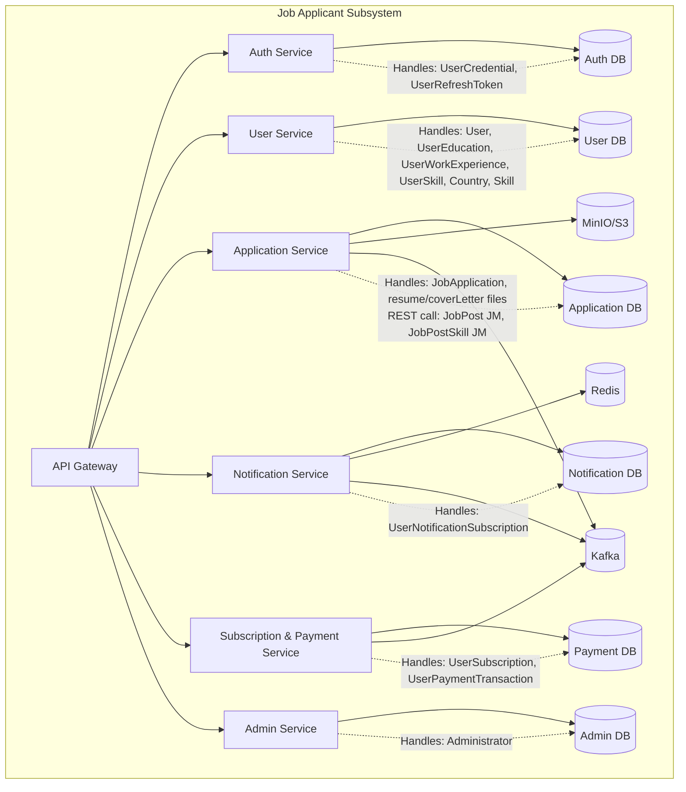

# c:\Users\dorem\Documents\ArchSys\SpringBootKafka\docs\Service.md

## JA Subsystem Microservice Container Diagram (Lean Version)

```mermaid
flowchart TD
    subgraph JA_Subsystem[Job Applicant Subsystem]
        JA_API[API Gateway]
        AuthService[Auth Service]
        UserService[User Service]
        ApplicationService[Application Service]
        NotificationService[Notification Service]
        PaymentService[Subscription & Payment Service]
        AdminService[Admin Service]
        AuthDB[(Auth DB)]
        UserDB[(User DB)]
        ApplicationDB[(Application DB)]
        NotificationDB[(Notification DB)]
        PaymentDB[(Payment DB)]
        AdminDB[(Admin DB)]
        Redis[(Redis)]
        Kafka[(Kafka)]
        FileStore[(MinIO/S3)]
    end

    JA_API --> AuthService
    JA_API --> UserService
    JA_API --> ApplicationService
    JA_API --> NotificationService
    JA_API --> PaymentService
    JA_API --> AdminService

    AuthService --> AuthDB
    UserService --> UserDB
    ApplicationService --> ApplicationDB
    NotificationService --> NotificationDB
    PaymentService --> PaymentDB
    AdminService --> AdminDB

    ApplicationService --> FileStore
    NotificationService --> Redis
    NotificationService --> Kafka
    ApplicationService --> Kafka
    PaymentService --> Kafka

    %% Service responsibilities
    AuthService -.->|Handles: UserCredential, UserRefreshToken| AuthDB
    UserService -.->|Handles: User, UserEducation, UserWorkExperience, UserSkill, Country, Skill| UserDB
    ApplicationService -.->|Handles: JobApplication, resume/coverLetter files<br>REST call: JobPost JM, JobPostSkill JM| ApplicationDB
    NotificationService -.->|Handles: UserNotificationSubscription| NotificationDB
    PaymentService -.->|Handles: UserSubscription, UserPaymentTransaction| PaymentDB
    AdminService -.->|Handles: Administrator| AdminDB
```
